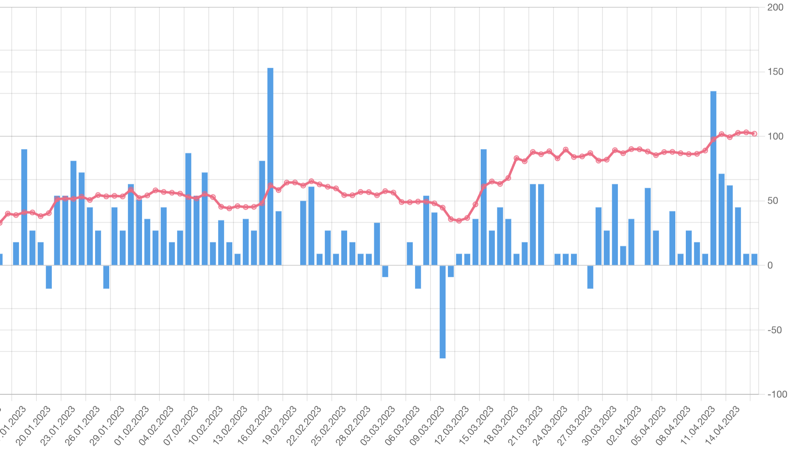

# bitcoin-predict-backend

Fetch news articles and rate them with the help of chatgpt. Provide a api for bitcoin-predict-frontend.

# License

If you make money with this method. It would be great if you gave me some of your profit. I have not been able to use the method successfully so far. I assume no responsibility for anything.

# Install

tbd

1. Update `.env` file
2. Run migrations
3. See Usage
4. Install bitcoin-predict-frontend to see results

# Usage

Fetch news into database. News will be fetched per day. Every day will be fetched only once if that day is done. So you can start this command more than once. If you want to refetch all days you can use the option `--reset-cache`.
`./bin/console app:fetch-news`

Update the csv with domain popularity infos. This should be used after `app:fetch-news`:
`./bin/console app:update-popularity-csv`

Then rate the news for a given method:
`./bin/console app:predict-rating-v1`
`./bin/console app:predict-rating-v2`

# Rating Method for PredictRatingV2

## Method

- Every news will be rated between -10 and 10; -10 is bad; 10 is good
- Ask chatgpt for rate the news title: positive = 10, negative=-10 and neutral=0
- Add popularity based on source. I used the Global Ranking from https://www.similarweb.com/website/theage.com.au/#overview. The rank (3000000 to 1) will be transformed to 0.1 and 1. The transformed value will be multiplied with the inital score from chatgpt.
- Used news scope:
  - api: mediastack.com
  - languages: en
  - categories: technology,business,general

## Prompt

Forget all your previous instructions. Pretend you are a financial and crypto expert. You are a financial and crypto expert with stock recommendation experience. Answer “YES” if good news, “NO” if bad news, or “UNKNOWN” if uncertain in the first line. Don't answer more than that. Headline:

## Conclusion

tbd

## Recommendation and ideas for v3

tbd

# Rating Method for PredictRatingV1

If you want to use this method, please adjust the `FetchNewsCommand.php` regarding to the news scope. Delete all news before this. I don't want a perfect tool, im just interessted in the results. Sorry for my lazyness :D

## Method

- Every news will be rated between -10 and 10; -10 is bad; 10 is good
- Ask chatgpt for rate the news title: positive = 10, negative=-10 and neutral=0
- Add popularity based on source. I used the Global Ranking from https://www.similarweb.com/website/theage.com.au/#overview. The rank (3000000 to 1) will be transformed to 0.5 and 1. The transformed value will be multiplied with the inital score from chatgpt.
- Used news scope:
  - api: mediastack.com
  - languages: en
  - categories: technology,business
  - keywords: crypto, bitcoin

## Prompt

Forget all your previous instructions. Pretend you are a financial expert. You are a financial expert with stock recommendation experience. Answer “YES” if good news, “NO” if bad news, or “UNKNOWN” if uncertain in the first line. Then elaborate with one short and concise sentence on the next line. Headline:

## Conclusion

Unfortunately, the Mediastack API has a bug, which is why only news from the last 3 months are available. Despite paid tariff. Overall, I can't see any connection between news and the chart.
The chart shows entries per calendar day. The news scores are simply added up per calendar day.
The problem why it can't work is perhaps the too small selection of news.

## Recommendation and ideas for v2

- Add more news. I think all news that can also influence the stock market is also relevant for Bitcoin. Don't filter the news for keywords.
- Switch to another news api, if mediastack cannot provide historical news.
- Scrape the content of the news and include dem in the ChatGPT rating.
- Make the prompt more bitcoin-based. ChatGpt may therefore not rate the news in relation to bitcoin.
- Change the popularity ratio to 0.1 to 1. This will give more impact for the popularity.
